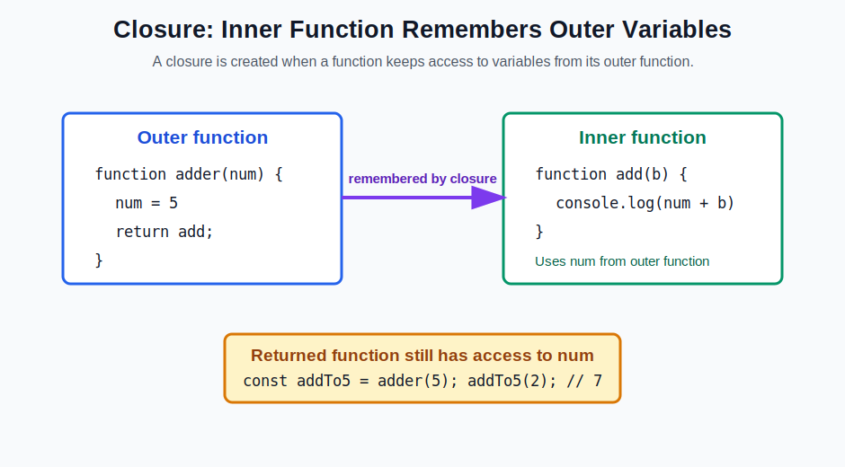
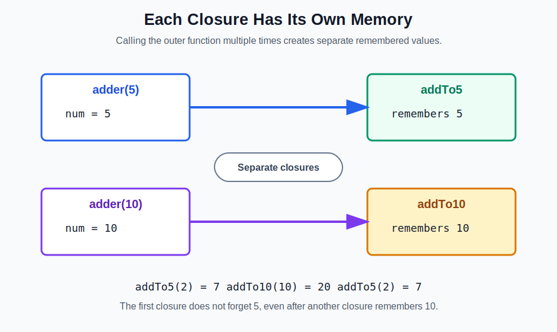
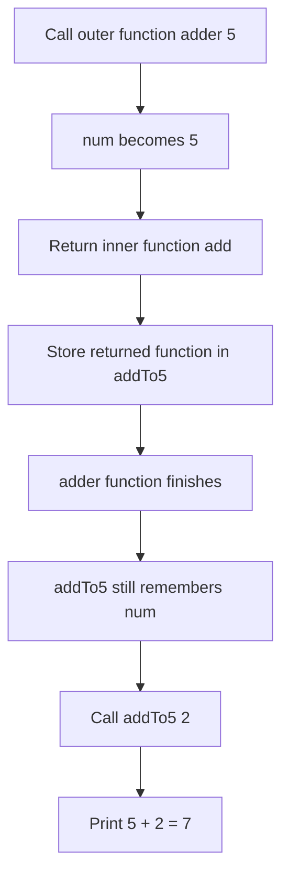

# Closures in JavaScript

This folder explains **closures** in JavaScript using simple words, code examples, and diagrams.

The example file is:

```text
closure.js
```

## What Is a Closure?

A **closure** happens when an inner function remembers variables from its outer function, even after the outer function has finished running.

Simple meaning:

> A closure is a function with memory.

## Basic Diagram



In JavaScript, functions can be created inside other functions.

The inner function can use:

- its own variables
- variables from the outer function
- global variables

When the inner function is returned, it still remembers the outer function variables. That remembered connection is called a **closure**.

## Example From This Project

```js
function adder(num) {
    function add(b) {
        console.log(num + b);
    }
    return add;
}

const addTo5 = adder(5);
const addTo10 = adder(10);

addTo5(2);
addTo10(10);
addTo5(2);
```

## What Happens Step by Step?

### Step 1: `adder(5)` is called

```js
const addTo5 = adder(5);
```

Here:

- `num` becomes `5`.
- The inner function `add` is returned.
- `addTo5` stores that returned function.

Even after `adder(5)` finishes, `addTo5` still remembers `num = 5`.

### Step 2: `adder(10)` is called

```js
const addTo10 = adder(10);
```

Here:

- `num` becomes `10`.
- A new inner function is returned.
- `addTo10` stores that returned function.

This is a separate closure. It remembers `num = 10`.

## Adder Closure Diagram



## Output

When this code runs:

```js
addTo5(2);
addTo10(10);
addTo5(2);
```

The output is:

```text
7
20
7
```

Why?

```text
addTo5(2)    => 5 + 2  = 7
addTo10(10)  => 10 + 10 = 20
addTo5(2)    => 5 + 2  = 7
```

`addTo5` remembers `5`.

`addTo10` remembers `10`.

Both functions have their own separate memory.

## Another Simple Closure Example

```js
function main(name) {
    function sayMyName() {
        console.log(name);
    }
    return sayMyName;
}

let consoleVidya = main("Vidya");
consoleVidya();
```

Output:

```text
Vidya
```

Here, `sayMyName` remembers the `name` variable from `main`.

Even after `main("Vidya")` finishes, the returned function still knows the value `"Vidya"`.

## Why Do Closures Work?

JavaScript uses something called **lexical scope**.

Lexical scope means a function can access variables from the place where it was created.

Example:

```js
function outer() {
    let message = "Hello";

    function inner() {
        console.log(message);
    }

    return inner;
}
```

The `inner` function was created inside `outer`, so it can access `message`.

When `inner` is returned, JavaScript keeps `message` alive because `inner` still needs it.

## Closure Formula

You can remember closure like this:

```text
Closure = Function + Outer Variables
```

Or:

```text
Inner function + remembered outer scope = closure
```

## Important Terms

| Term | Meaning |
| --- | --- |
| Outer function | The function that contains another function |
| Inner function | The function inside another function |
| Lexical scope | A function can access variables from where it was written |
| Closure | Inner function remembering outer function variables |
| Private variable | A variable that cannot be directly accessed from outside |

## Closures Can Create Private Variables

Closures are useful when we want to hide data.

Example:

```js
function counter() {
    let count = 0;

    return function() {
        count++;
        console.log(count);
    };
}

const increase = counter();

increase(); // 1
increase(); // 2
increase(); // 3
```

Here, `count` is private.

We cannot directly access it like this:

```js
console.log(count);
```

That will not work because `count` exists inside `counter`.

But the returned function remembers `count`, so it can update it.

## Real-Life Uses of Closures

Closures are used in many places in JavaScript.

Common uses:

- data privacy
- counters
- function factories
- callbacks
- event handlers
- timers like `setTimeout`
- maintaining state without global variables

## Closure With `setTimeout`

```js
function greetLater(name) {
    setTimeout(function() {
        console.log("Hello " + name);
    }, 1000);
}

greetLater("Vidya");
```

The inner function inside `setTimeout` remembers `name`.

After 1 second, it prints:

```text
Hello Vidya
```

This is also a closure.

## Closure With Function Factory

A function factory is a function that creates another function.

Your `adder` example is a function factory.

```js
function adder(num) {
    return function(b) {
        return num + b;
    };
}

const addTo100 = adder(100);

console.log(addTo100(50)); // 150
```

Here, `adder(100)` creates a new function that always adds `100`.

## Common Mistake

Many beginners think the outer variable is destroyed after the outer function finishes.

Normally, local variables are removed after a function finishes.

But with closures, if the inner function still needs the variable, JavaScript keeps that variable alive.

So this works:

```js
function outer() {
    let x = 10;

    return function inner() {
        console.log(x);
    };
}

const result = outer();
result(); // 10
```

`x` is still available because `inner` remembers it.

## Mermaid Diagram

This diagram shows the closure flow:



## How to Run

Open this folder in the terminal and run:

```bash
node closure.js
```

Expected output:

```text
7
20
7
```

## Quick Interview Answer

A closure is when a function remembers variables from its outer scope even after the outer function has finished executing.

Example:

```js
function adder(num) {
    return function(b) {
        return num + b;
    };
}
```

The inner function remembers `num`, so this is a closure.

## Summary

- A closure is a function with memory.
- Inner functions can remember outer function variables.
- Closures work because of lexical scope.
- Each closure can have its own separate memory.
- Closures are useful for private variables, counters, callbacks, event handlers, and function factories.
- In this project, `addTo5` remembers `5` and `addTo10` remembers `10`.
