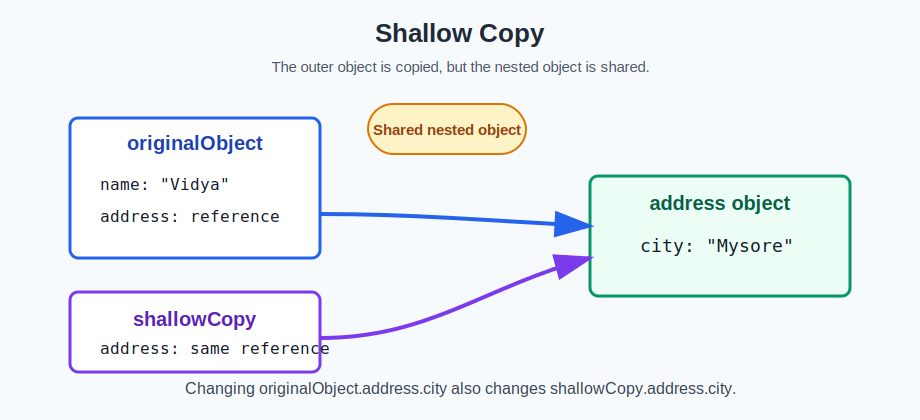
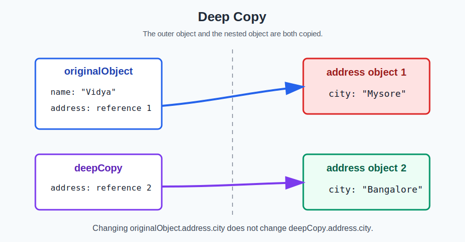
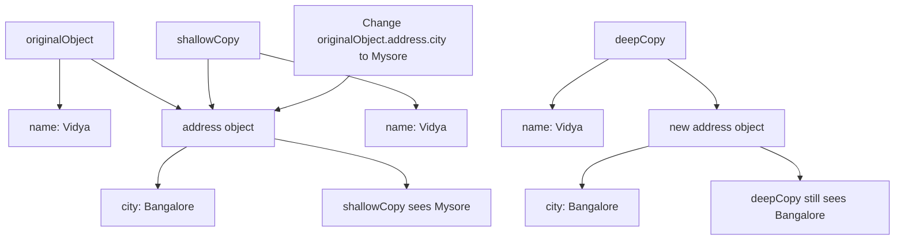

# Shallow Copy and Deep Copy in JavaScript

This folder explains the difference between a **shallow copy** and a **deep copy** in JavaScript.

The example file is:

```text
shallowdeepcopy.js
```

## Simple Idea

When we copy an object in JavaScript, there are two common types of copy:

1. **Shallow copy**
2. **Deep copy**

They look similar at first, but they behave differently when the object has another object inside it.

## Object Used in This Example

```js
let originalObject = {
    name: "Vidya",
    address: {
        city: "Bangalore"
    }
};
```

Here, `originalObject` has:

- `name`, which is a simple value.
- `address`, which is another object inside the main object.

This inner object is called a **nested object**.

## What Is a Shallow Copy?

A shallow copy copies only the first level of an object.



In this project:

```js
let shallowCopy = { ...originalObject };
```

The spread operator `{ ...originalObject }` creates a shallow copy.

That means:

- `name` is copied normally.
- `address` is still shared between `originalObject` and `shallowCopy`.

So if we change:

```js
originalObject.address.city = "Mysore";
```

Then `shallowCopy.address.city` also becomes `"Mysore"`.

## What Is a Deep Copy?

A deep copy copies all levels of an object.



In this project:

```js
let deepCopy = JSON.parse(JSON.stringify(originalObject));
```

This creates a new copy of the object, including the nested `address` object.

That means:

- `name` is copied.
- `address` is also copied as a new object.

So if we change:

```js
originalObject.address.city = "Mysore";
```

Then `deepCopy.address.city` still stays `"Bangalore"`.

## Diagram

This diagram shows both copies together:



## Output of the Code

The code changes the city in the original object:

```js
originalObject.address.city = "Mysore";
```

Then it prints:

```js
console.log(shallowCopy.address.city);
console.log(deepCopy.address.city);
```

Output:

```text
Mysore
Bangalore
```

## Why This Happens

JavaScript objects are stored by reference.

That means a variable does not directly hold the full object. It holds a reference, or link, to where the object is stored in memory.

In a shallow copy, nested objects keep the same reference.

In a deep copy, nested objects get new references.

## When to Use Each Copy

Use a **shallow copy** when the object has only simple values, or when sharing nested objects is okay.

Use a **deep copy** when the object has nested objects or arrays and you want the copy to be completely independent.

For example, user profiles, settings objects, shopping carts, and API responses often need careful copying because they can contain nested data.

## Shallow Copy vs Deep Copy

| Feature | Shallow Copy | Deep Copy |
| --- | --- | --- |
| Copies first-level values | Yes | Yes |
| Copies nested objects fully | No | Yes |
| Nested object is shared | Yes | No |
| Change in nested object affects copy | Yes | No |
| Example in this project | `{ ...originalObject }` | `JSON.parse(JSON.stringify(originalObject))` |

## How to Run

Open this folder in the terminal and run:

```bash
node shallowdeepcopy.js
```

Expected output:

```text
Mysore
Bangalore
```

## Important Note

`JSON.parse(JSON.stringify(object))` is simple and useful for learning, but it has limits.

It does not correctly copy some special values like:

- functions
- `undefined`
- `Date` objects
- `Map`
- `Set`

For modern JavaScript, you can also use:

```js
let deepCopy = structuredClone(originalObject);
```

But the JSON method is easy to understand for this basic example.

## Summary

- A shallow copy copies only the outer object.
- A deep copy copies the outer object and nested objects.
- In this example, `shallowCopy` changes when the nested city changes.
- `deepCopy` does not change because it has its own nested object.
